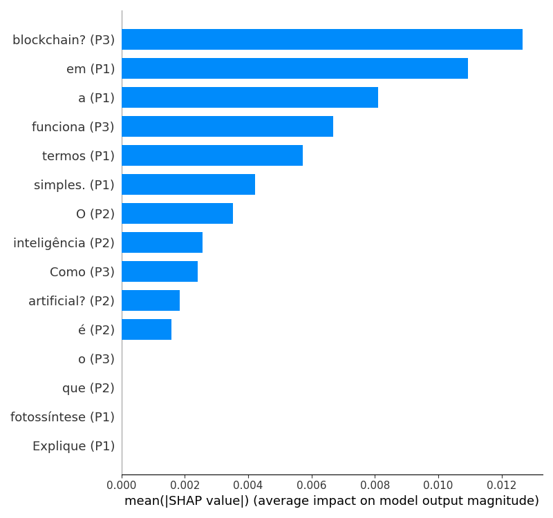
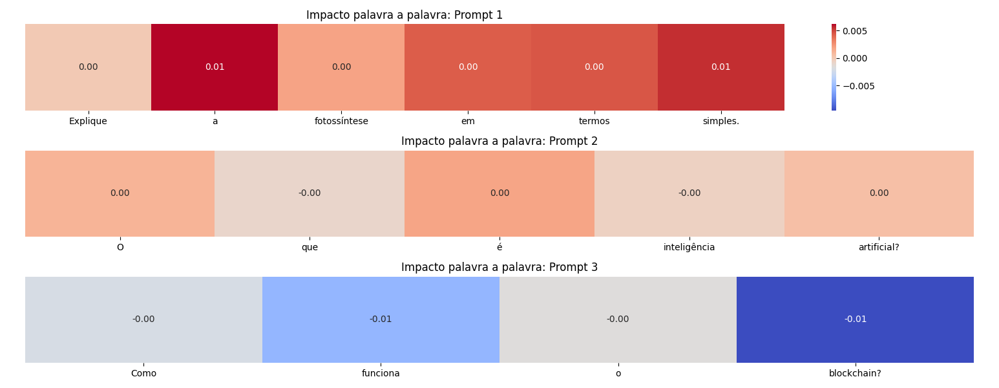

# Análise de Embeddings e Explicabilidade de Modelos de Texto

Este projeto tem como objetivo analisar e interpretar a influência de palavras em prompts de modelos de linguagem utilizando embeddings e técnicas de explicabilidade como SHAP.

---

## Funcionalidades

- Geração de embeddings de textos usando **SentenceTransformer** (`all-MiniLM-L6-v2`).
- Análise de similaridade semântica entre palavras e frases via **cosine similarity**.
- Criação de heatmaps palavra a palavra para entender a representatividade de cada termo nos prompts.
- Estrutura de código preparada para integração com modelos LLM via API (ex.: deepseek-r1).

---

## Conceitos e Considerações

### Sentence Transformer

- Utilizar os embeddings do próprio modelo consumido (deepseek-r1 aqui) seria ideal, mas **não está disponível via API**.
- Se o modelo fornecesse vetores internos por token/camada ou hidden states, estaríamos mais próximos do ideal de explicabilidade.
- O `SentenceTransformer` (`all-MiniLM-L6-v2`) é um modelo pré-treinado que gera embeddings capturando **similaridade semântica de texto**.
- Na prática, ele transforma qualquer texto em vetores numéricos consistentes, baseados no seu treinamento em deep learning.
- Cada palavra ou frase vira um vetor de **384 valores**.
- Funciona como uma **régua semântica universal**, fornecendo o modelo de dados necessário para o SHAP.

### Heatmap de Representatividade de Palavras

- Para aprofundar a representatividade de cada palavra do prompt:
  - **Não reduzir embeddings por média**, ou reduzir de forma mais representativa.
  - Alterar a função wrapper para refletir **influência de cada palavra**, em vez de somar toda a resposta.
  - Usar **cosine similarity** ajuda a capturar influência relativa de cada palavra.
  - SHAP detecta diferenças mais claras entre palavras que têm **impacto maior ou menor**.

---

## Requisitos

- Python 3.10+
- Bibliotecas:
  - `sentence-transformers`
  - `numpy`
  - `shap`
  - `matplotlib`
  - `seaborn`
  - `scikit-learn` (para `cosine_similarity`)

Instalação rápida:

```bash
pip install -r requirements.txt 
```

## SHAP Values


## Heatmap

